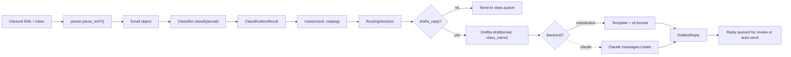

# Email triage automation

[](https://github.com/derekgallardo01/email-triage-automation/actions/workflows/ci.yml) [](LICENSE) [](#) [](https://codespaces.new/derekgallardo01/email-triage-automation)

**Docs:** [Getting started](docs/getting-started.md) · [Architecture](docs/architecture.md) · [Customization](docs/customization.md) · [Evaluation](docs/evaluation.md) · [Diagrams](docs/diagrams.md) · [FAQ](docs/faq.md)

**Live demo:** [derekgallardo01.github.io/email-triage-automation](https://derekgallardo01.github.io/email-triage-automation/) — seven bundled EML fixtures classified, routed, and (where appropriate) replied to, with confidence scores and routing decisions per email.

End-to-end inbox triage: **parse → classify → route → draft**. Every
incoming email gets a class label, a destination queue, an SLA, and
(for the classes that warrant it) a draft reply. Low-confidence cases
go to human review instead of the wrong queue.

Default backend is deterministic — rule-based classification +
substitution-based drafting. No API keys, no network. The seam is one
method (`Drafter._draft_claude`); set `EMAIL_TRIAGE_LLM=claude` to route
drafting through Claude.

```bash
pip install -e .
email-triage demo                              # all 7 bundled fixtures
email-triage list-classes                      # show the 6 classes + queues
email-triage triage fixtures/01-sales-lead.eml
```

```bash
python -m pytest -q     # 33 unit tests
python evals/run.py     # 7 classification cases + 3 draft cases, per-class P/R/F1
```

Stdlib-only Python (uses `email.parser` for EML/mbox parsing). `anthropic`
is an optional extra.

## Run in Docker

```bash
docker build -t email-triage .
docker run --rm email-triage                            # runs `email-triage demo`
docker run --rm email-triage pytest -q                  # runs the tests
docker run --rm -v $(pwd)/inbox:/inbox email-triage email-triage triage /inbox/your.eml
```

## What it's for

Every SMB engagement eventually asks "can we automate our inbox?"
The naïve approach is one giant LLM prompt that reads the email and
decides what to do. That fails because:

- **Cost.** Hitting an LLM for every inbound is 1000-100,000 calls a
  day. Most emails are obvious.
- **Latency.** Routing should happen in seconds, not after a 1-3s LLM
  call.
- **Wrong queue is worse than no queue.** A confused LLM routes
  customer complaints to the marketing folder.
- **No audit trail.** "Why did this email get sent to AP?" with an
  LLM answer is hard to debug.

This kit is the right shape:

- **Parser** — `email.parser` stdlib. Handles EML files, mbox dumps,
  raw bytes. Production: wire to IMAP / Microsoft Graph / Gmail API.
- **Classifier** — keyword + length-weighted scoring with internal-
  domain override. Same pattern as
  [document-classifier-kit](https://github.com/derekgallardo01/document-classifier-kit),
  specialized for emails (subject weighs 2x body).
- **Router** — confident classifications go to the class's queue;
  below-threshold goes to `human_review`. Three review-routing
  reasons emitted.
- **Drafter** — per-class reply templates with `{sender_name}` /
  `{subject}` / `{body_excerpt}` substitution. Default backend is
  literal substitution; LLM swap for more contextual drafts.
- **Eval suite** — golden classification cases + golden draft-quality
  cases. CI gates on both.

## Classes (the bundled catalog)

| Class | Queue | SLA | Auto-drafts reply? |
|---|---|---|---|
| `sales_lead` | `sales_pipeline` | 4h | ✓ |
| `support_request` | `support_l1` | 8h | ✓ |
| `billing_question` | `billing_team` | 12h | (no — billing handles directly) |
| `feature_request` | `product_backlog` | 120h | ✓ |
| `newsletter_or_marketing` | `archive_marketing` | (none) | (no — archived) |
| `internal` | `internal` | 24h | (no — passthrough) |

Plus `unknown` → `human_review` (24h SLA) as the fallback. Swap in
your own catalog for a real engagement — one Python file.

## End-to-end demo

```
[ROUTE] 01-sales-lead.eml         -> sales_lead             (1.00) -> sales_pipeline +DRAFT
[ROUTE] 02-support-request.eml    -> support_request        (0.80) -> support_l1 +DRAFT
[ROUTE] 03-billing-question.eml   -> billing_question       (1.00) -> billing_team
[ROUTE] 04-feature-request.eml    -> feature_request        (1.00) -> product_backlog +DRAFT
[ROUTE] 05-newsletter.eml         -> newsletter_or_marketing (1.00) -> archive_marketing
[ROUTE] 06-internal.eml           -> internal               (1.00) -> internal
[REVIEW] 07-ambiguous.eml         -> unknown                (0.00) -> human_review

Classifier backend: rules.  Drafter backend: substitution.
6/7 routed confidently; 1 sent to human_review; 3 replies drafted.
```

The ambiguous email is in the fixtures **deliberately** — it tests
that the human-review path actually fires when nothing matches.

## Architecture



## What's inside

| Path | Purpose |
|---|---|
| `src/email_triage/parser.py` | EML + mbox parser (stdlib only) |
| `src/email_triage/catalog.py` | `Catalog` + `EmailClass` + default 6-class catalog |
| `src/email_triage/classifier.py` | Keyword classifier + router + internal-domain override |
| `src/email_triage/drafter.py` | Per-class reply drafter (substitution + Claude seam) |
| `src/email_triage/cli.py` | `email-triage triage / demo / list-classes` |
| `prompts/<class>.txt` | Per-class reply templates |
| `fixtures/*.eml` | 7 bundled emails (1 per class + 1 ambiguous) |
| `tests/` | 33 pytest tests across parser + classifier + drafter |
| `evals/classification.json` | 7 gold-labelled classification cases |
| `evals/drafts.json` | 3 draft-quality cases (contains_all rubric) |
| `evals/run.py` | Eval harness with per-class P/R/F1 |
| `pyproject.toml` | Package + `email-triage` script entry |

## Wire to your real inbox

The parser layer is the integration point. Replace `parse_eml_file()`
with whichever inbox source you have:

- **Gmail** — `googleapiclient.discovery.build('gmail', 'v1')` →
  `users.messages.list()` → `users.messages.get(format='raw')` →
  pass the base64-decoded bytes to `parse_eml_bytes()`.
- **Microsoft 365 / Outlook** — Microsoft Graph
  `GET /me/messages?$select=...` → pass MIME bytes to `parse_eml_bytes()`.
- **IMAP (anything else)** — `imaplib` → `FETCH BODY[]` → bytes.

Everything downstream of `parse_eml_bytes()` (the classifier, router,
drafter, eval harness) doesn't change.

## Wire to your real outbound

After the drafter returns a `DraftedReply`, your caller decides what
to do:

```python
if draft.confidence >= 0.85:
    smtp_send(to=email.sender_email, subject=draft.subject, body=draft.body)
else:
    review_queue.enqueue({
        "incoming": email,
        "draft": draft,
        "decision": decision,
    })
```

The kit produces the **draft**; you provide the **transport**.

## Companion repos

- [document-classifier-kit](https://github.com/derekgallardo01/document-classifier-kit) — the same classification + routing pattern applied to documents instead of emails. Internals are nearly identical.
- [prompt-registry-kit](https://github.com/derekgallardo01/prompt-registry-kit) — for production-grade reply-template management with eval-gated promotion + rollback, point the drafter's `prompts/` dir at that kit's registry.
- [nocode-ai-lead-workflow](https://github.com/derekgallardo01/nocode-ai-lead-workflow) — same confidence-routed pattern applied to leads (cross-channel dedupe baked in).
- [m365-agents-sdk-example](https://github.com/derekgallardo01/m365-agents-sdk-example) — wire this triage pipeline into an M365 agent so the agent can read + reply through Teams or Outlook.
