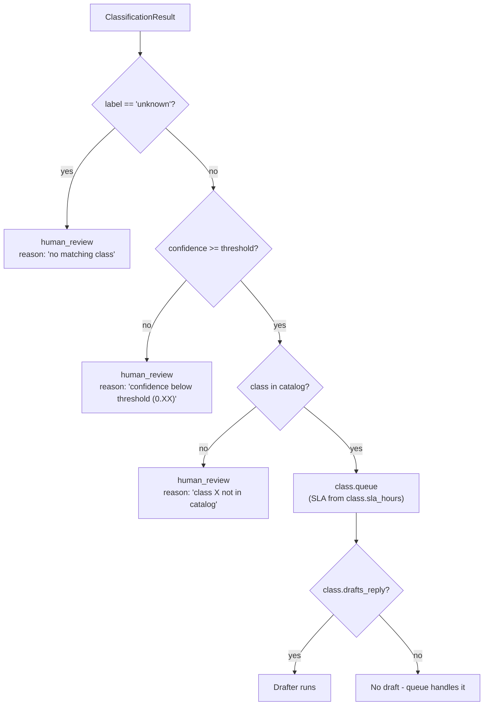
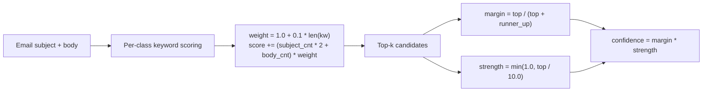
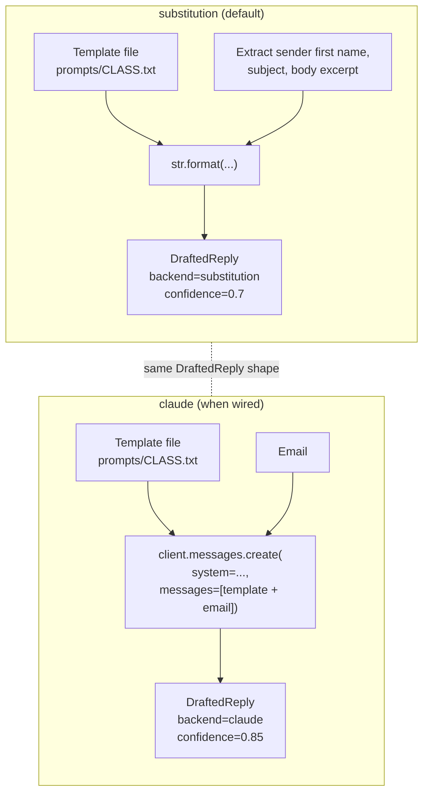
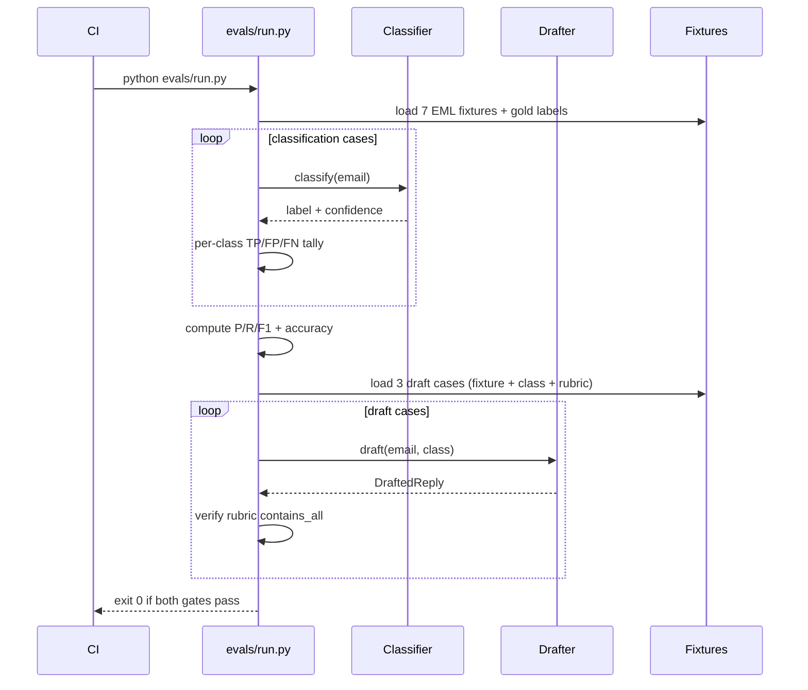
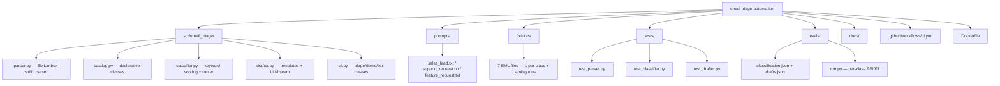

# Diagrams

GitHub renders Mermaid natively. These render on the README and here.

## End-to-end triage pipeline

```mermaid
flowchart LR
    I[Inbound EML / mbox / Graph / Gmail] --> P["parser.parse_eml_bytes()"]
    P --> E[Email object]
    E --> C["Classifier.classify(email)"]
    C --> ID{Internal domain?}
    ID -- yes --> INT["label='internal'<br/>conf=1.0"]
    ID -- no --> KW[Keyword score per class]
    KW --> CR[ClassificationResult]
    INT --> CR
    CR --> R["route(result, catalog)"]
    R --> RD[RoutingDecision]
    RD --> Q{drafts_reply?}
    Q -- no --> OUT1[class.queue]
    Q -- yes --> D["Drafter.draft(email, class_name)"]
    D --> DB{Backend?}
    DB -- substitution --> SUB[Template + str.format]
    DB -. claude .-> LLM[Claude messages.create]
    SUB --> DRAFT[DraftedReply]
    LLM --> DRAFT
    DRAFT --> OUT2[Reply queued]
```

## Routing decisions (3 review paths + 1 happy path)

## Confidence scoring

Subject keywords weigh 2x body keywords because in real inboxes,
subjects are denser signal.

## Drafter backends

## Eval suite (two independent gates)

## Repo shape

